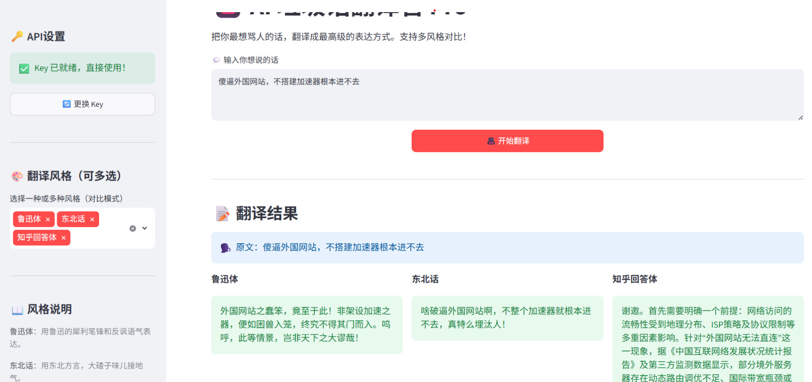

# 🎩 AI 垃圾话翻译官 Pro

把你最想骂人的话，翻译成最高级的表达方式。

**10种风格** · **多风格对比** · **一键截图分享**

---

## 📸 效果展示

### 多风格对比翻译

---

## 🚀 快速开始

### 1. 克隆项目
git clone https://github.com/你的用户名/translator.git
cd translator

### 2. 安装依赖
pip install streamlit openai

### 3. 运行
streamlit run translator_pro.py

### 4. 获取 API Key
去 DeepSeek开放平台(https://platform.deepseek.com) 免费注册，创建 API Key。
首次运行时，在侧边栏输入 Key 并点击保存，以后会自动记住。

---

## ✨ 功能特性

- 🎨 10种翻译风格
- 🆚 多风格对比模式
- 🔑 本地安全存储API Key
- 📸 一键复制分享文本
- 🎉 彩蛋系统
- 📜 历史记录

---

## 🛠️ 技术栈

- Python + Streamlit
- DeepSeek API
- 10套结构化提示词

---

## ⭐ 如果觉得好玩，点个 Star 支持一下！
